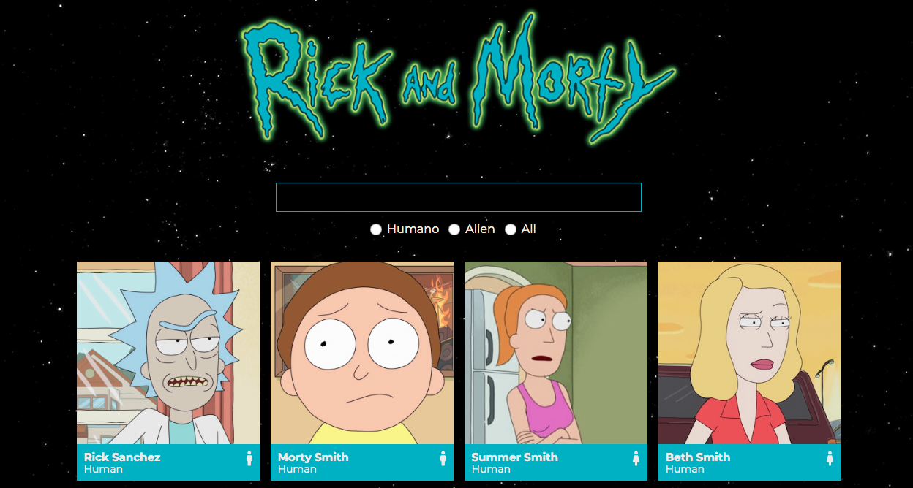

Buscador de personajes de la serie Rick y Morty

El proyecto, página web con un listado de personajes de Rick and Morty, que podemos filtrar por el nombre del personaje. Tambien se pueden filtrar según la especie. Así mismo cuando pinchas en uno de los personajes, accedes a los detalles de cada personaje.  

Lenguaje y herramientas
HTML5 | SCSS | JavaScript | React |

Para comenzar hay que ejecutar varios comandos:

Clonar el repositorio

git clone

Instalar las dependencias del proyecto

npm install

Iniciar el sevidor local

npm start

